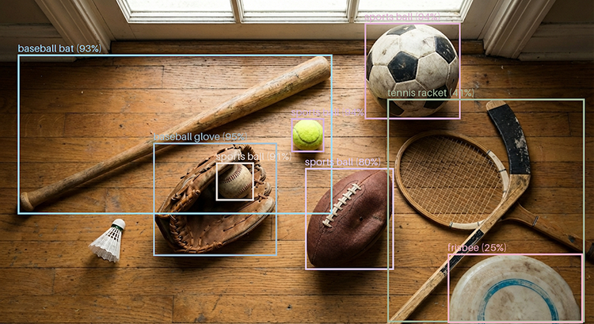

# Real-Time Object Detection with RF-DETR and Amazon SageMaker

Learn how to deploy and performance test the state-of-the-art RF-DETR object detection model to Amazon SageMaker using PyTorch for production-ready, real-time inference with GPU acceleration.




## Features

- Uses pre-trained RF-DETR-Large model with COCO labels
- Creates SageMaker-compatible model artifact
- Deploys real-time endpoint with GPU acceleration
- Custom PyTorch inference handler
- Supports images and video
- Includes performance testing with [Locust](https://locust.io/)
- Local inference support for image and video detection (No AWS required)
- Instance segmentation with RF-DETR Seg Preview model

## Project Structure

```text
├── code/                    # SageMaker model code
│   ├── inference.py        # Custom inference handler
│   └── requirements.txt    # SageMaker dependencies
├── local_inference/        # Local testing scripts
├── locust_scripts/         # Load testing with Locust
├── tests/                  # Unit tests
├── utils/                  # Utility functions
├── scripts/                # Setup and utility scripts
├── docker/                 # Docker configurations
├── pyproject.toml          # Project configuration
├── Makefile               # Development commands
└── README.md              # This file
```

## Configuration

The project uses environment variables for configuration. See `config.py` for all available options:

- `RFDETR_MODEL` - Model checkpoint filename
- `RFDETR_MODEL_TYPE` - Model variant (nano/small/medium/base/large)
- `RFDETR_CONF` - Confidence threshold (0.0-1.0)
- `RFDETR_RESOLUTION` - Input resolution (divisible by 56)
- `RFDETR_OPTIMIZE` - Enable inference optimization
- `RFDETR_COMPILE` - Enable torch.jit.trace compilation

## Usage

### SageMaker Deployment

1. Proceed to your Amazon SageMaker Studio space
2. `git clone` this repository to your Studio environment
3. Run the Jupyter notebook [deploy_rf_detr.ipynb](deploy_rf_detr.ipynb)
   - Uses `rf-detr-large.pth` model checkpoint
   - Packages model artifact with inference code
   - Deploys to SageMaker real-time endpoint
   - Tests object detection on sample images
4. Optionally, use [Locust](https://locust.io/) to load test your endpoint (see [README.md](locust_scripts/README.md))

### Local Inference (Without AWS/SageMaker)

For local testing without deploying to SageMaker:

**Image Detection:**

```bash
python local_inference/object_detection_image.py
```

Demonstrates image segmentation using RF-DETR Seg Preview model with multiple annotation styles (masks, boxes, labels, outlines).

**Video Detection:**

```bash
python local_inference/object_detection_video.py
```

Processes video files with object detection using RF-DETR models (base/medium/large).

Available model checkpoints: `rf-detr-base.pth`, `rf-detr-medium.pth`, `rf-detr-large.pth`, `rf-detr-seg-preview.pt`

## Quick Start

### Option 1: Automated Setup (Recommended)

```bash
# Run the setup script
./scripts/setup_env.sh

# Activate the environment
source .venv/bin/activate
```

### Option 2: Manual Setup

```bash
# Create and activate virtual environment
python3.12 -m venv .venv
source .venv/bin/activate

# Install dependencies
make install-dev

# Setup pre-commit hooks
pre-commit install
```

#### Mac

```bash
brew install python@3.12

python3.12 -m pip install virtualenv --break-system-packages -Uq
python3.12 -m venv .venv
source .venv/bin/activate

python3.12 -m pip install pip -Uq

python3.12 -m pip install -r requirements.txt -Uq
```

#### Windows

```cmd
py -3.12 -m venv .venv
.\.venv\Scripts\activate
# or posh
.\.venv\Scripts\Activate.ps1

python -m pip install pip -Uq

cd local_inference/
python -m pip install -r requirements-local-inference.txt -Uq
python -m pip install --extra-index-url https://download.pytorch.org/whl/cu128 torch torchcodec torchaudio xformers -Uq

ffmpeg -i sample_video_traffic_annotated.mp4 -i sample_video_traffic.mp4 -c:v copy -c:a aac -map 0:v:0 -map 1:a:0 temp_output.mp4; if ($?) { Move-Item -Force temp_output.mp4 sample_video_traffic_annotated.mp4 }

ffmpeg -i chinatown-nyc-optimized-annotated.mp4 -i chinatown-nyc-optimized.mp4 -c:v copy -c:a aac -map 0:v:0 -map 1:a:0 temp_output.mp4; if ($?) { Move-Item -Force temp_output.mp4 chinatown-nyc-optimized-annotated-with-audio.mp4 }


ffmpeg -i "chinatown-nyc.mov" `
  -vf "fps=30,`
hqdn3d=1.5:1.5:6:6,`
unsharp=5:5:0.7:5:5:0.0,`
eq=brightness=0.02:contrast=1.1,`
format=gray" `
  -c:v libx264 -crf 18 -preset slow -an `
  "chinatown-nyc-optimized-v2.mp4"

ffmpeg -i chinatown-nyc-optimized-v2.mp4 `
  -i chinatown-nyc-optimized.mp4 -c:v copy -c:a aac -map 0:v:0 -map 1:a:0 temp_output.mp4; `
  if ($?) { Move-Item -Force temp_output.mp4 chinatown-nyc-optimized-v2-with-audio.mp4 }

ffmpeg -i chinatown-nyc-optimized-annotated-v2_01.mp4 `
  -i chinatown-nyc-optimized.mp4 -c:v copy -c:a aac -map 0:v:0 -map 1:a:0 temp_output.mp4; `
  if ($?) { Move-Item -Force temp_output.mp4 chinatown-nyc-optimized-annotated-v2_01-with-audio.mp4 }

ffmpeg -i chinatown-nyc-optimized-annotated-v2_02a.mp4 `
  -i chinatown-nyc-optimized.mp4 -c:v copy -c:a aac -map 0:v:0 -map 1:a:0 temp_output.mp4; `
  if ($?) { Move-Item -Force temp_output.mp4 chinatown-nyc-optimized-annotated-v2_02a-with-audio.mp4 }

ffmpeg -i chinatown-nyc-optimized-annotated-v2_02c.mp4 `
  -i chinatown-nyc-optimized.mp4 -c:v copy -c:a aac -map 0:v:0 -map 1:a:0 temp_output.mp4; `
  if ($?) { Move-Item -Force temp_output.mp4 chinatown-nyc-optimized-annotated-v2_02c-with-audio.mp4 }

ffmpeg -i chinatown-nyc-optimized-annotated-v2_03.mp4 `
  -i chinatown-nyc-optimized.mp4 -c:v copy -c:a aac -map 0:v:0 -map 1:a:0 temp_output.mp4; `
  if ($?) { Move-Item -Force temp_output.mp4 chinatown-nyc-optimized-annotated-v2_03-with-audio.mp4 }

ffmpeg -i chinatown-nyc-optimized-annotated-v2_04.mp4 `
  -i chinatown-nyc-optimized.mp4 -c:v copy -c:a aac -map 0:v:0 -map 1:a:0 temp_output.mp4; `
  if ($?) { Move-Item -Force temp_output.mp4 chinatown-nyc-optimized-annotated-v2_04-with-audio.mp4 }

ffmpeg -i chinatown-nyc-optimized-annotated-v2_05.mp4 `
  -i chinatown-nyc-optimized.mp4 -c:v copy -c:a aac -map 0:v:0 -map 1:a:0 temp_output.mp4; `
  if ($?) { Move-Item -Force temp_output.mp4 chinatown-nyc-optimized-annotated-v2_05-with-audio.mp4 }

ffmpeg -i chinatown-nyc-optimized-annotated-v2_06.mp4 `
  -i chinatown-nyc-optimized.mp4 -c:v copy -c:a aac -map 0:v:0 -map 1:a:0 temp_output.mp4; `
  if ($?) { Move-Item -Force temp_output.mp4 chinatown-nyc-optimized-annotated-v2_06-with-audio.mp4 }

ffmpeg -i chinatown-nyc-optimized-annotated-v2_07.mp4 `
  -i chinatown-nyc-optimized.mp4 -c:v copy -c:a aac -map 0:v:0 -map 1:a:0 temp_output.mp4; `
  if ($?) { Move-Item -Force temp_output.mp4 chinatown-nyc-optimized-annotated-v2_07-with-audio.mp4 }
```

### Option 3: Docker Development

```bash
# Build and run development container in background
docker compose up -d rf-detr-dev

# Check if container is running
docker compose ps

# Execute commands in the running container
docker compose exec rf-detr-dev bash

# Run tests in container
docker compose exec rf-detr-dev pytest

# Run linting in container
docker compose exec rf-detr-dev make lint

# View container logs
docker compose logs -f rf-detr-dev

# Stop and remove container when done
docker compose down rf-detr-dev
```

**Locust Load Testing:**

```bash
# Run Locust load testing (opens web UI on http://localhost:8089)
docker compose up -d locust

# Stop Locust
docker compose down locust
```

## Development Commands

```bash
make help          # Show all available commands
make lint          # Run Python linting checks
make lint-fix      # Fix Python formatting issues
make lint-markdown # Lint markdown files
make type-check    # Run type checking with mypy
make test          # Run tests with pytest
make clean         # Clean up build artifacts
make deploy-local  # Test local inference
```

### Docker Commands

```bash
# Development container
docker compose up -d rf-detr-dev    # Start in background
docker compose exec rf-detr-dev bash # Access container shell
docker compose logs rf-detr-dev      # View logs
docker compose down rf-detr-dev      # Stop and remove

# Load testing
docker compose up -d locust          # Start Locust (http://localhost:8089)
docker compose down locust           # Stop Locust
```

## License

This project is licensed under the MIT License. See the [LICENSE](LICENSE) file for details.

## Disclaimer

The contents of this repository represent my viewpoints and not those of my past or current employers, including Amazon Web Services (AWS). All third-party libraries, modules, plugins, and SDKs are the property of their respective owners.
